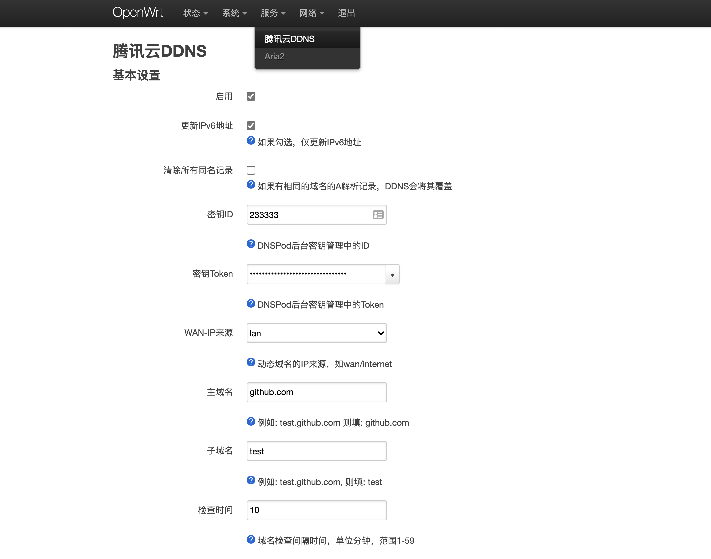

# 腾讯云DDNS插件

## 1.插件介绍
> OpenWRT TencentDDNS插件是一款腾讯云研发的，自动映射动态公网IP至用户指定的DNSPod域名解析记录的官方插件。

| 标题       | 名称                                                         |
| ---------- | ------------------------------------------------------------ |
| 中文名称   | 腾讯云DDNS插件                                    |
| 英文名称   | luci-app-tencentddns                                   |
| 最新版本   | 0.2.0 (2021.09.12)                                           |
| 适用平台   | [Lean OpenWRT](https://github.com/coolsnowwolf/lede)         |
| 适用产品   | [DNSPod](https://www.dnspod.cn/)|
| GitHub项目 | [tencentcloud-openwrt-plugin-ddns](https://github.com/Tencent-Cloud-Plugins/tencentcloud-openwrt-plugin-ddns)                            |
| 主创团队   | 腾讯云中小企业产品中心（SMB Product Center of Tencent Cloud） |

## 2.功能特性

- 可在安装了openwrt的软路由上，将运营商分配的家庭宽带公网IP动态关联到指定的DNSPod域名解析记录上。实现通过域名访问家庭内网服务的目的。

  

## 3.安装指引

### 3.1.安装ipk包（推荐）

x86_64平台的预编译安装包可以在[此处](https://github.com/SSSSSimon/tencentcloud-openwrt-plugin-ddns/releases/tag/v0.2.0)下载，登录openwrt路由器，进入系统→软件包页面，将ipk包上传至路由器并安装即可。

### 3.2.源码编译安装

1. 安装好openWrt编译环境。
2. cd进openwrt编译目录的package目录
3. 把源代码克隆到本地
4. 编译 po2lmo (如果有po2lmo可跳过)\
   `pushd package/tencentcloud-openwrt-plugin-ddns/tencentcloud_ddns/tools/po2lmo
   make && sudo make install popd`
5. 返回上级目录，开始编译\
   `make package/tencentcloud-openwrt-plugin-ddns/tencentcloud_ddns/compile V=s`
6. 把生成的ipk包上传到路由器，用opkg安装
   opkg install luci-app-tencentddns_0.2.0-1_all.ipk

## 4.使用指引

### 4.1.界面功能介绍

> 上图主要是配置DDNS插件的腾讯云参数，包括密钥ID、密钥Token、WAN-IP来源、主域名和子域名等

### 4.2.名词解释
- **启用**：是否开启腾讯云DDNS
- **更新IPv6地址**：如果勾选，仅更新IPv6地址
- **清除所有同名记录**：如果一个域名有多个A解析记录，是否一并清除
- **密钥ID**：DNSPod后台密钥管理中的ID，获取地址：[DNSPod密钥管理](https://console.dnspod.cn/account/token)
- **密钥Token**：DNSPod后台密钥管理中的Token。获取地址：[DNSPod密钥管理](https://console.dnspod.cn/account/token)
- **主域名**：主域名，如: github.com
- **子域名**：子域名，如：www
- **检查时间**：后台对域名解析检查的时间间隔

 

## 5.FAQ

> 暂无

## 6.版本迭代记录

### 6.1 tencentcloud-openwrt-plugin-ddns v0.1.0
- 支持在软路由提供DDNS服务
### 6.2 tencentcloud-openwrt-plugin-ddns v0.2.0
- 增加IPv6支持

## 7.注意事项

> 如果要更新IPv6地址，IP来源选择`lan`

## 8. 联系我们

&nbsp;&nbsp;&nbsp;扫码备注“春雨”来联络到我们 

